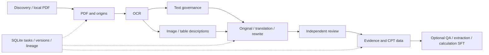

# FinFlow

[中文](README.md) · **English**

[Chinese documentation](https://chal1ce.github.io/FinFlow/zh/) · [English documentation](https://chal1ce.github.io/FinFlow/en/)

Turn financial documents into traceable pretraining and SFT data.

FinFlow connects source discovery, OCR, text and visual governance, multimodal
descriptions, optional translation/rewriting, and independent quality review.
PDFs, images, tables, and derived files stay on local disk; SQLite tracks tasks,
versions, and lineage. A target tokenizer segments accepted text for continual
pretraining (CPT).

## Features

- Collection from CNINFO, SSE, Crossref, and OpenAlex; manual PDF input.
- PaddleOCR integration, cleaning, metadata normalization, and quality checks.
- Image/table crops in one asset table, retaining table OCR and visual descriptions.
- Independent review, target-tokenizer segmentation, and grouped splits.
- Evidence-grounded SFT: document QA, extraction and calculations; optional visual QA and table transcription with packaged images.
- Generation methods and mixtures: knowledge transformations; grounded Self-Instruct, answer-first, Evol-Instruct and CodecLM;
  visual descriptions/conversations; fixed/temperature mixtures and local DoReMi/RegMix proxy experiments.
- Incremental runs, bounded retries, recovery, deduplication, lineage, immutable releases.
- Automatic CPT/SFT quality and coverage reports, coverage gaps and version comparisons: [report guide](docs/en/quality-report.md).
- Persistent cross-version MinHash indexing, duplicate relations and auditable mixture filtering: [near-dedup guide](docs/en/near-dedup.md).
- Feishu, Telegram, Discord, and Slack commands, PDF imports, human visual review, reports, and MCP tools for assistants.



FinFlow generates training files. A downstream training program trains the target model.
DoReMi/RegMix run explicitly requested small proxy experiments to learn mixtures; daily jobs never launch them automatically.
SFT runs independently or as an optional daily stage, disabled by default.

Optional [daily training publication](docs/en/training-publication.md) connects snapshots, near deduplication, mixtures, verification and version publication through one `.env`. SQLite tracks recovery and lineage; failures retain the previous `latest`. Daily reports are available as JSON/Markdown.


Optional [small-model refiner](docs/en/text-refiner.md): disabled by default, with audit/apply modes, a separate rewrite switch and a configurable model. Adds reviewed CPT candidates while preserving source evidence, operation lineage and reports.

## Quick start

Python 3.10+ is required. The daily flywheel currently runs on macOS/Linux:

```sh
python3 -m venv .venv
. .venv/bin/activate
python -m pip install -e .
cp -n .env.example .env
```

Add missing fields to an existing `.env` without overwriting it. Follow the
[flywheel guide](docs/en/data-flywheel.md) to configure OCR, vision, independent
review, and the target tokenizer. Use `FIN_DOC_FLYWHEEL_POLICY` in the same `.env` to override source admission and daily recipe defaults. Defaults use original text and visual
descriptions; translation/rewriting require additional configuration.

```sh
python -m workflow.flywheel_cli preflight
python -m workflow.flywheel_cli run
python -m workflow.flywheel_cli status
```

Preflight checks local configuration without service requests. See
[scheduling](docs/en/data-flywheel.md#6-daily-scheduling) for cron/launchd templates.
For manual financial workflows or existing OCR, use `python -m workflow.cli list`.

## Documentation

| Goal | Guide |
| --- | --- |
| Installation and choosing a workflow | [Quick start](docs/en/quick-start.md) |
| Models, admission, review, retries, lineage, releases | [Daily data flywheel](docs/en/data-flywheel.md) |
| Messaging apps or OpenClaw / Hermes access | [App integrations and MCP](docs/en/app-integrations.md) · [Telegram](docs/en/app-telegram.md) · [Discord](docs/en/app-discord.md) · [Slack](docs/en/app-slack.md) |
| Text or visual SFT from v7 evidence | [Text SFT](docs/en/sft.md) · [Visual SFT](docs/en/sft-vision.md) |
| Generation methods and learned mixtures | [Methods](docs/en/training-methods.md) · [Mixtures](docs/en/data-mixtures.md) · [DoReMi / RegMix](docs/en/mixture-experiments.md) |
| Existing v5/v6 exports | [Existing release export](docs/en/pretraining.md) |
| Actual missing configuration | [Environment check](docs/en/environment-check.md) |
| Detailed OCR, acquisition, governance, CLI, operations | [Reference guides; detailed pages in Chinese](docs/en/reference.md) |
| Add bilingual pages or images | [Documentation authoring](docs/en/docs-authoring.md) |
| Publish the website | [GitHub Pages](docs/en/github-pages.md) |

## Project status

149 offline tests passed before the public repository migration. The new application
integration, SFT and method/mixture code have passed static checks; functional tests and live validation are pending. Real OCR/model
integration and quality still require configured validation. Scheduler templates
are not installed automatically. The formal flywheel has no mock fallback;
unconfirmed source usage or quality issues remain reviewable.

DoReMi/RegMix workflows are algorithm adaptations; FinFlow has no real-corpus proxy results or reproduced paper scores yet.

Development commands:

```sh
python -m pip install -e '.[dev]'
python -m pytest -q
python -m ruff check .
```

The [design plan](docs/data-flywheel-plan.md) is currently in Chinese.
