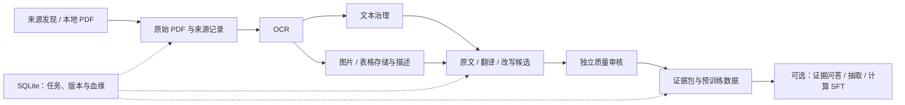

# FinFlow

**中文** · [English](README.en.md)

[中文文档网站](https://chal1ce.github.io/FinFlow/zh/) · [English documentation](https://chal1ce.github.io/FinFlow/en/)

把金融文档转成可追溯的预训练与 SFT 数据。

项目自动采集财报、研报与相关论文，串接 OCR、文本与图表治理、多模态描述、
可选翻译/改写和独立质量审核，再按目标 tokenizer 生成预训练语料。
PDF、图片、表格和派生文件保存在本地，SQLite 记录任务、版本与来源血缘。

[使用说明](docs/index.md) · [快速开始](docs/quick-start.md) · [每日数据飞轮](docs/data-flywheel.md) · [OCR 部署](docs/paddleocr_remote.md) · [命令参考](docs/cli-reference.md)

## 可以做什么

- **采集与导入**：接入巨潮资讯、上交所、Crossref、OpenAlex，也支持手工提供 PDF。
- **OCR 与治理**：连接 PaddleOCR，完成文本清洗、元数据处理、分块和质量检查。
- **图片与表格**：保存区域图像，共用一张资产表；保留表格 OCR 结构和多模态描述。
- **SFT 数据**：文档问答、JSON 抽取和表格计算；可选原图问答与表格转 JSON，多模态数据随包保存图片。
- **预训练数据**：将原文、图表描述及可选翻译/改写送入独立审核，按目标 tokenizer 分段。
- **生成方法与配比**：知识提炼、教材化与事实列表；Self-Instruct、答案反推、Evol-Instruct、CodecLM 证据适配，图像描述及多轮问答；固定/温度配比与 DoReMi、RegMix 本地代理实验。
- **自动运行与追溯**：每日增量采集、任务重试、断点恢复、去重、血缘查询及不可变发布。
- **数据质量与覆盖**：自动生成 CPT/SFT 统计报告、覆盖缺口与版本差异，见[报告指南](docs/quality-report.md)。
- **跨版本近似去重**：SQLite 增量 MinHash 索引、重复关系与可追溯配比过滤，见[去重指南](docs/near-dedup.md)。
- **应用连接**：飞书、Telegram、Discord、Slack 的命令、PDF 导入、图表人工复核和日报；MCP 接口支持外部助手调用。

## 处理流程



每日飞轮生成训练数据文件；目标模型训练由下游训练程序执行。SFT 可独立运行或作为每日流程的可选阶段，默认关闭。
DoReMi/RegMix 是另外显式启动的小型代理训练实验，用于学习配比，不随每日任务自动运行。

## 快速开始

需要 Python 3.10 或以上。macOS / Linux 在项目根目录执行：

```sh
python3 -m venv .venv
. .venv/bin/activate
python -m pip install -e .
# 仅首次创建本机配置；已有 .env 时补充字段
cp -n .env.example .env
```

Windows 安装方式见[运行前检查](docs/local_operations.md#1-运行前检查)。

### 每日采集 → 治理 → 预训练数据

按[飞轮运行说明](docs/data-flywheel.md)填写 OCR、视觉/审核模型和目标 tokenizer，
并在 [config/flywheel.json](config/flywheel.json) 中确认来源训练准入。
默认生成原文和图表描述；翻译、改写需另行启用并配置模型。

```sh
# 只检查配置与本地依赖，不请求网络服务
python -m workflow.flywheel_cli preflight

# 配置通过后，执行一次完整流程
python -m workflow.flywheel_cli run

# 查看任务状态
python -m workflow.flywheel_cli status
```

每日调度使用仓库提供的 cron / launchd 模板，安装步骤见[定时运行](docs/data-flywheel.md#6-每日定时)。

### 手工处理财报 / 已有 OCR

```sh
python -m workflow.cli list
```

按输入状态选择本地 PDF、已采集财报或已有 OCR 路径，见[本地运行与运维手册](docs/local_operations.md#2-三条交付路径)。

## 使用说明

| 你要做的事 | 文档 |
| --- | --- |
| 找到合适入口、了解阅读顺序 | [文档首页](docs/index.md) |
| 配置模型、运行飞轮、处理待复核记录、追查血缘 | [每日数据飞轮](docs/data-flywheel.md) |
| 从聊天软件操作，或连接 OpenClaw / Hermes | [应用连接与 MCP](docs/app-integrations.md) · [Telegram](docs/app-telegram.md) · [Discord](docs/app-discord.md) · [Slack](docs/app-slack.md) |
| 单独发现来源或下载 PDF | [数据来源与采集](docs/acquisition.md) |
| 手工处理财报、了解目录和交付内容 | [财报处理与交付](docs/financial-workflow.md) |
| 调整清洗规则、切片与 LLM 治理 | [清洗与治理](docs/governance.md) |
| 从 v7 证据生成文本或多模态 SFT | [文本 SFT](docs/sft.md) · [图表多模态 SFT](docs/sft-vision.md) |
| 扩展生成方法、调整数据比例或学习配比 | [方法库](docs/training-methods.md) · [数据配比](docs/data-mixtures.md) · [DoReMi / RegMix](docs/mixture-experiments.md) |
| 从已有 v5/v6 发布包构建语料 | [已有发布包生成预训练语料](docs/pretraining.md) |
| 部署或连接 OCR 服务 | [PaddleOCR 部署与连接](docs/paddleocr_remote.md) |
| 查看日志、备份、恢复和排错 | [日志说明](docs/logging.md) · [运维手册](docs/local_operations.md) |
| 查询参数与环境变量 | [命令参考](docs/cli-reference.md) · [配置模板](.env.example) |
| 给使用说明新增页面或图片 | [文档与图片写作指南](docs/docs-authoring.md) |

## 项目状态

每日飞轮已实现，迁移公开仓库前 149 项离线测试通过。应用连接、SFT 和新增方法/配比为后续实现，目前完成静态检查，尚未功能测试或实连验收。
DoReMi/RegMix 提供算法适配流程，尚无本项目真实语料训练结果；不宣称复现原论文的规模或性能。
真实 OCR/模型服务的完整实跑和输出质量仍需在配置后验证；
定时模板不会自动安装到系统。正式飞轮没有 mock 回退，未确认的来源与质量问题会保留在审核记录中。

开发与离线检查：

```sh
python -m pip install -e '.[dev]'
python -m pytest -q
python -m ruff check .
```

详细设计与实施范围见[数据飞轮计划](docs/data-flywheel-plan.md)。
