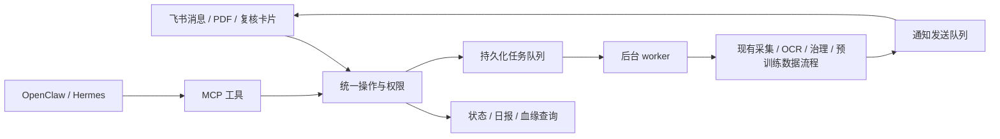

# 飞书与 MCP 接入

通过飞书查询飞轮状态、提交 PDF、查看图表候选和完成人工复核；也可以让 OpenClaw、Hermes 等 MCP 客户端调用 FinFlow。
两个入口共用任务、权限和血缘服务。原生飞书入口使用固定命令，外部助手负责自然语言交互。

本版本提供飞书消息连接和本地 stdio MCP 服务。飞书云文档、多维表格、其他原生消息渠道与远程 HTTP MCP 尚未接入。
接入层目前完成代码和静态检查，真实飞书收发、卡片回调以及外部助手联调仍需配置后验证。



## 1. 安装与本机配置

在项目根目录，使用 Python 3.10+、macOS 或 Linux：

```sh
. .venv/bin/activate
python -m pip install -e '.[feishu,mcp]'
cp -n .env.example .env
cp -n config/integrations.json config/integrations.local.json
```

只需一个入口时可只安装 `.[feishu]` 或 `.[mcp]`。已有 `.env` 时补充字段。
`config/integrations.local.json` 已被 Git 忽略，适合存放本机用户 ID、会话 ID 和路径。

在 `.env` 中配置：

```dotenv
FINFLOW_FEISHU_APP_ID=cli_your_app_id
FINFLOW_FEISHU_APP_SECRET=your_app_secret
```

MCP 只读查询不需要飞书凭证或模型。执行采集、OCR、治理和数据生成，仍需完成[每日飞轮配置](data-flywheel.md)。
所有进程应使用同一份飞轮配置和数据目录；通过 `--flywheel-config`、`--data-root` 可以显式指定，均放在子命令之前。

## 2. 飞书应用设置

使用飞书自建应用，启用机器人并发布应用版本，让目标用户可见。在开放平台配置与实际用途对应的消息权限：

| 用途 | 权限标识 |
| --- | --- |
| 接收用户给机器人的单聊消息 | `im:message.p2p_msg:readonly` |
| 接收群内 @ 机器人的消息 | `im:message.group_at_msg:readonly` |
| 机器人发送消息 | `im:message:send_as_bot` |
| 读取消息及其附件资源 | `im:message:readonly` |
| 获取、上传消息图片与文件 | `im:resource` |

在事件订阅中选择长连接，订阅 `im.message.receive_v1`。使用复核按钮时，在回调配置中启用新版 `card.action.trigger` 长连接回调。
FinFlow 使用飞书官方 Python SDK 接收事件，应用无需公开 webhook 地址。旧版卡片回调不在支持范围内。
权限名称、版本发布要求和租户审批以[飞书开放平台](https://open.feishu.cn/document/home/index)为准；
参考[官方 SDK](https://github.com/larksuite/oapi-sdk-python)和[卡片回调说明](https://open.feishu.cn/document/feishu-cards/card-callback-communication)。

从开放平台的 API 调试工具获取该应用下用户的 `open_id`，填入本机配置的 `feishu` 部分：

```json
{
  "enabled": true,
  "users": {
    "ou_your_open_id": ["viewer", "operator", "reviewer"]
  },
  "allowed_group_chats": [],
  "notification_chats": []
}
```

这是 `feishu` 字段的内容，保留外层配置的 `schema_version` 等其他字段。

| 角色 | 权限 |
| --- | --- |
| `viewer` | 查询状态、日报、任务、候选及血缘 |
| `operator` | 另可导入 PDF、提交运行、重试任务 |
| `reviewer` | 另可对自己获取的复核卡片作出人工决定 |

未列入 `users` 的用户不接受命令。其他角色自动具备查询权限；`operator` 和 `reviewer` 相互独立。
群聊还需将 `oc_...` 会话 ID 加入 `allowed_group_chats`，命令必须 @ 当前机器人。
PDF 首先使用单聊发送；没有机器人 mention 信息的群文件消息会被忽略。
配置或环境变量修改后重启相关进程生效。

如果后台保存订阅时提示“应用未建立长连接”，先完成本机配置并启动下面的 `feishu` 命令，保持在线，再返回开放平台保存订阅。

检查配置并启动：

```sh
python -m integrations.cli --config config/integrations.local.json preflight --channel feishu
python -m integrations.cli --config config/integrations.local.json feishu
```

`preflight` 只检查本机配置和依赖，不请求飞书或模型。顶层 `status` 表示渠道配置，嵌套的 `pipeline.status` 表示处理流程配置。
顶层通过、处理流程缺项时，仍可连接并查询；导入的 PDF 会先保存并排队，任务结果为 `partial`。

`feishu` 命令同时启动消息连接和后台 worker，在前台持续运行。电脑休眠、关机或退出进程后无法继续收发。
需要长期运行时交给服务器进程管理器；GitHub Pages 只承载静态使用说明。

## 3. 飞书操作

| 输入 | 作用 |
| --- | --- |
| `/help` | 命令说明 |
| `/status` | 处理队列、图表资产、候选和通知状态 |
| `/report` 或 `/report 2026-10-02` | 按配置时区查询日报 |
| `/audit` | 列出前 20 个待复核候选 |
| `/candidate 候选ID` | 查看正文、证据附件；有图像时发送原图 |
| `/trace candidate 候选ID` | 追查候选来源；也支持 `sample`、`artifact` |
| `/run` | 提交一轮采集和处理 |
| `/run --no-discover` | 处理已有数据及积压任务 |
| `/job job-...` | 查看后台任务结果 |
| `/retry 任务ID` 或 `/retry job-...` | 显式重试可重试的任务 |
| 直接发送 PDF 文件 | 保存附件、登记来源血缘，并排队处理 |

长任务先返回 `job_id`，完成或失败后再通知。PDF 默认上限 32 MiB，可在 `max_attachment_mb` 修改。
按飞书消息 ID 去重；同一条消息重复投递不会重复提交任务。人工重新发送的消息视为新请求。
重试底层任务只重新入队，之后执行 `/run --no-discover` 或等待现有每日调度。

PDF 导入保留应用、会话、消息、文件和操作者的来源记录，后续 PDF → OCR → 图表/文本 → 候选 → 训练样本继续使用现有血缘。
重复文件共享内容文件，不同来源记录仍分别保留。手动重试同一个导入任务沿用原始来源。

### 图表和文本复核

`reviewer` 获取 `/candidate` 时，机器人依次发送原图（若有）、完整候选 JSON 和复核卡片。
卡片正文可能截断，以附件和原始证据为准。点击“接受 / 拒绝 / 待复核”会记录当前用户身份和决定。
也可使用卡片中的 ticket 填写具体原因：

```text
/review 卡片中的TICKET rejected 表格金额单位与原图不一致
```

ticket 绑定申请者、会话、候选文件校验和与当前决定版本，默认一小时有效。
转发卡片、其他用户点击、过期或候选更新后均不能沿用旧授权；重新获取 `/candidate`。
同一张卡片只能提交一个决定；修改决定需要获取新卡片。原图校验失败时不会接受复核。

通过审核仍需满足 `config/flywheel.json` 中的来源训练准入。
应用上传来源分别为 `app-feishu`、`app-mcp`、`app-local`，默认未批准训练用途。
只在确认该来源适用范围后配置 `source_policy`，这会影响该渠道的全部文件；当前尚无逐份上传文件的许可管理界面。
审核通过的候选在下一次飞轮运行时进入发布流程。

### 日报通知

在 `notification_chats` 中填写允许接收日报的 `oc_...` 会话 ID，保持 worker 在线。
当天出现新的已保存飞轮摘要时，worker 排队发送更新的日报；同一运行、同一会话只排队一次。
时区默认 `Asia/Shanghai`。候选和积压数量是最近一次运行的累计快照，处理任务与模型请求是当天运行摘要的汇总。
这不是额外的采集调度器，继续使用[现有 cron / launchd](data-flywheel.md#6-每日定时)。
宕机跨日后可用 `/report 日期` 补查；没有生成摘要的预检失败不会出现在自动日报中。

## 4. 连接 OpenClaw / Hermes

默认 MCP 只提供六个查询工具：`finflow_status`、`finflow_report`、`finflow_candidates`、
`finflow_candidate`、`finflow_trace`、`finflow_job`。它是本机 stdio 进程，由外部助手启动。

在外部助手配置中使用绝对路径，把示例 `/path/to/FinFlow` 替换为实际目录。
保持 `cwd` 为 FinFlow 根目录，以加载正确的 `.env`。

### OpenClaw

合并以下内容到 OpenClaw 的配置（默认 `~/.openclaw/openclaw.json`）：

```json
{
  "mcp": {
    "servers": {
      "finflow": {
        "transport": "stdio",
        "command": "/path/to/FinFlow/.venv/bin/python",
        "args": ["-m", "integrations.cli", "--config", "/path/to/FinFlow/config/integrations.local.json", "--data-root", "/path/to/FinFlow/data", "mcp"],
        "cwd": "/path/to/FinFlow",
        "enabled": true
      }
    }
  }
}
```

对应字段见 [OpenClaw MCP 配置](https://docs.openclaw.ai/tools/mcp)。

### Hermes

合并到 `~/.hermes/config.yaml`：

```yaml
mcp_servers:
  finflow:
    command: /path/to/FinFlow/.venv/bin/python
    args:
      - -m
      - integrations.cli
      - --config
      - /path/to/FinFlow/config/integrations.local.json
      - --data-root
      - /path/to/FinFlow/data
      - mcp
    cwd: /path/to/FinFlow
    enabled: true
```

对应字段见 [Hermes MCP 配置](https://hermes-agent.nousresearch.com/docs/user-guide/features/mcp/)。
重启或重新加载客户端后，可让助手“查询 FinFlow 今天的处理状态”。本项目提供标准接口，尚未在两款助手中实连验收。

### 可选写操作

需要让助手提交任务时，将本机配置中的 `mcp` 设置为：

```json
{
  "allow_mutations": true,
  "import_roots": ["/absolute/path/to/incoming-pdfs"]
}
```

随后重启 MCP 和 worker。增加三个工具：`finflow_run`、`finflow_import_pdf`、`finflow_retry`。
导入仅接受允许目录中的单份 PDF；符号链接解析后的实际路径也必须在允许目录内。
写工具要求 `request_id`，同一请求重传时复用 ID；参数变化需新 ID。
执行会使用已有 OCR/模型服务与预算，返回 `job_id` 后用 `finflow_job` 查询。

MCP 不提供人工复核工具，不能把模型决定记作人工决定。它以一个本机服务身份调用，并不区分外部助手背后的聊天用户；
若外部助手面向多人，保留只读默认值或使用外部助手自身的授权控制。

只使用 MCP 时，需要另开一个终端运行 worker：

```sh
python -m integrations.cli --config config/integrations.local.json --data-root /path/to/FinFlow/data worker
```

如果已经运行同配置的 `feishu`，其内置 worker 可以处理 MCP 任务。

## 5. 本地操作、恢复与存储

本机 CLI 也可提交任务：

```sh
python -m integrations.cli status
python -m integrations.cli import-pdf /absolute/path/report.pdf --request-id report-2026-10-02
python -m integrations.cli run --no-discover --request-id run-2026-10-02
python -m integrations.cli job job-任务ID
```

这些命令使用默认配置；使用本机配置时同样在子命令前加 `--config config/integrations.local.json`。
`worker --once` 各尝试一条消息、一个任务和一条通知，适合手动处理队列；它可能执行完整飞轮，并非只读检查。

| 路径（相对于数据目录） | 内容 |
| --- | --- |
| `state/integrations.db` | 消息收件队列、应用任务、通知、复核 ticket 与操作审计 |
| `state/pipeline.db` | 原有处理任务、图表资产、候选、工件血缘 |
| `integrations/inbox/` | 按 SHA-256 保存的导入 PDF |
| `integrations/downloads/` | 下载过程中的临时文件，正常处理后移除 |
| `manifests/source_records/` | 应用来源记录，注册为血缘工件 |

应用任务使用进程锁串行执行，并复用飞轮锁；正在运行系统调度时，应用任务保持等待。
进程意外退出后，原 `running` 应用任务标记为 `interrupted`，检查底层结果后用 `/retry job-...` 显式重试。
已提交的人工复核不自动重试；重新获取候选检查最新决定。

消息和通知采用持久化队列，失败最多自动尝试五次并退避。通知保存各阶段发送回执，并使用飞书消息 UUID 辅助去重；
网络或进程中断仍可能造成重复通知，不承诺严格一次投递。

恢复失败通知：

```sh
python -m integrations.cli --config config/integrations.local.json deliveries --status failed
python -m integrations.cli --config config/integrations.local.json retry-delivery 通知ID
```

修复凭证、权限或网络问题后重发，已成功的阶段保留回执。访问权限已撤回的通知会标记 `rejected`，不能用此命令恢复。
收件队列失败可从 `/status` 看数量；修复原因后重新发送原命令或文件。
异常结果只返回错误类型，不返回服务端原始响应。备份时停止相关进程，保存整个数据目录，包含 SQLite 文件及本地证据。

## 6. 开发位置

- `integrations/service.py`：复用飞轮的业务动作、来源登记和人工复核。
- `integrations/store.py`、`runtime.py`：持久化队列、进程锁、后台执行与通知。
- `integrations/channels/feishu.py`：消息归一化、附件与卡片。
- `integrations/mcp_server.py`：只读默认、可选写工具的 MCP 服务。
- `integrations/cli.py`：统一运行入口。

实现参考消息适配器、统一工具、队列与通知的架构思路，未复制 OpenClaw/Hermes 源码，也不依赖其代理运行时。
新增其他渠道时，在验证平台身份后映射到相同服务动作，并保留权限、消息去重、来源信息和发送回执。
