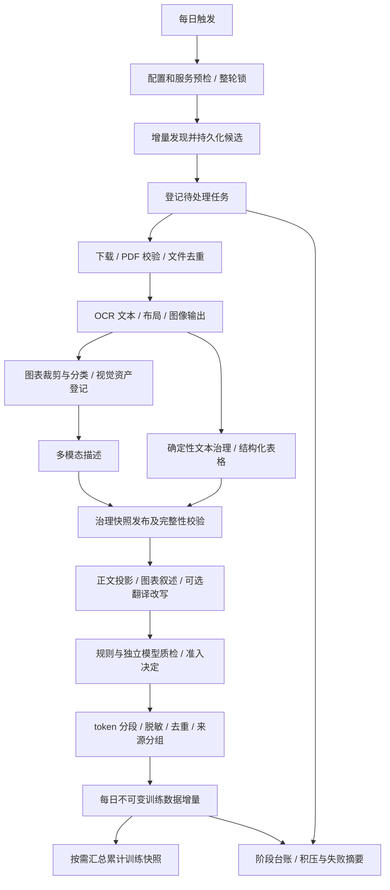

# 金融文档数据飞轮改造计划书
{: .no_toc }

## 本页目录
{: .no_toc }

1. TOC
{:toc}

[文档首页](index.md) · [项目首页](https://github.com/Chal1ce/FinFlow/blob/main/README.md)

日期：2026-10-01
状态：用户已批准实施；实现与运行说明见 `data-flywheel.md`
项目：`FinFlow`

## 1. 目标和范围

将现有练习项目完善为可每日运行的数据处理系统。在配置来源、OCR 服务、模型和 tokenizer 后，自动完成增量采集、文档与视觉资产治理，以及预训练数据生成。每条训练样本都应能回查原始文件、处理位置、模型输出和质量判定。

本计划按现有文本继续预训练（CPT）路线设计：图片和表格保存原图，并由多模态模型生成文本描述，合格描述进入文本语料。训练模型的启动、GPU 调度和 checkpoint 管理不属于本轮数据生成范围。若后续要求训练视觉语言模型，再扩展图文配对样本格式。

独立的毕业论文数据处理项目仅供只读参考。借鉴其确定性预筛、有界队列、逐块 checkpoint、模型与提示词版本身份、翻译/改写质量筛选和阶段流失台账；实现代码及配置留在金融项目。

第一版沿用当前配置的来源。是否增加监管政策、金融指南、行业资讯或更多公司，作为独立来源扩展事项确认。

## 2. 已有能力与需要补齐的部分

| 环节 | 当前能力 | 拟改动 |
| --- | --- | --- |
| 采集 | 巨潮、上交所财报；Crossref、OpenAlex 学术发现；下载与去重 | 增量扫描与后续处理队列解耦，处理来源更新、分页和积压任务 |
| 调度 | `run_collection.sh` 和每日 cron 示例 | 增加统一每日入口、整轮互斥、阶段恢复、无新数据时正常结束 |
| OCR | 自建/云端 PaddleOCR；原始结果和返回图片落盘 | 将新论文 OCR 接入每日流程，生成图/表区域与 OCR block 的映射 |
| 文本治理 | 清洗、分块、LLM 旁车、SQLite 记录 | 按待处理文档执行，视觉资产先登记，保留表格结构与相关上下文 |
| 视觉资产 | 有本地图片文件；文本规则默认过滤 image/chart | 增加统一资产主表、稳定身份、页码/bbox、文件校验和描述版本 |
| 发布 | 不可变 release、SHA-256 校验清单 | 新格式包含视觉资产、描述及血缘，并支持纯学术批次发布 |
| 预训练 | 从校验通过的 v5/v6 release 提取正文、脱敏、精确去重 | 接入模型派生候选、质量门、token 分段、每日增量及累计快照 |
| 观察 | 运行日志、状态、QC、工作流恢复 | 统一每日摘要、积压量、阶段流失、模型用量和样本回查 |

当前每日脚本没有向学术采集器传入 OCR backend；财报完整 OCR/治理/发布由独立环境变量开启。现有 `build-pretrain` 产出文本语料，但尚未自动接入每日运行。

现有 release 使用 SHA-256 检查文件完整性；这不等同于数字签名或来源认证。本轮沿用校验和机制。

## 3. 拟定每日流程

发现记录可靠落盘之后才推进扫描进度。后续下载、OCR 或模型任务即使延期，也由本地队列继续接管。分页未完成时保留同一查询窗口和 cursor，不直接以本轮结束时间跨过尚未发现的记录；扫描窗口考虑来源更新时间精度和适当重叠，由稳定 ID 去重。

首次运行按每日限额处理历史积压；后续优先补齐可重试任务，再处理新任务。财报和学术资料进入同一个每日批次，但保留各自元数据和来源身份。

## 4. 图片、表格存储与血缘

### 4.1 文件提取

图片和表格统一以区域图片保存。优先使用 OCR 返回的实际区域图；若表格只有 HTML/Markdown 和 bbox，则从对应页面按区域裁剪。裁剪前核对页面尺寸、旋转、方向矫正和坐标空间，记录转换参数。无法可靠定位的区域进入待复核状态。

`markdown.images` 和 `outputImages` 中的每个文件都需要标记用途。页级渲染图、布局可视化图与正文图/表区域分别登记；模型描述任务只接收目标区域图及明确记录的必要上下文。

视觉提取在文本清理前执行。文本规则删除图片占位符时，图像文件和资产记录仍保留。表格的原始 OCR HTML/结构、治理后的 Markdown、图像和模型描述作为同一来源区域的不同表示关联。

### 4.2 统一视觉资产主表

建议增加 `visual_asset`，图片与表格共用此表。

| 字段组 | 拟定内容 |
| --- | --- |
| 身份 | `visual_asset_uid`、图像文件 `artifact_uid` |
| 类型 | `asset_kind=image/table`；保留 `ocr_label=image/chart/table/...` |
| 来源 | `document_uid`、`work_uid`、PDF 的 `source_asset_uid` |
| OCR 身份 | backend、OCR 结果 artifact、attempt、模型/配置版本 |
| 定位 | 一基页码、OCR block index、bbox、坐标空间、裁剪参数 |
| 文件 | 数据根目录内的相对路径、SHA-256、MIME、宽高、文件大小 |
| 上下文 | 图题/表题、关联表格文本 artifact、章节或源 chunk ID |
| 状态 | 提取成功、待定位复核、文件失效等状态及时间 |

数据库存路径和元数据，图像二进制保存本地。相同图片字节可共用文件，但在不同文档/页面出现时分别保留来源记录。身份由原 PDF 版本、提取版本、定位和图像内容共同确定，文件名不作为身份。

### 4.3 描述与关联记录

增加 `visual_description`，以一对多关系保存视觉资产的描述版本：输入图像 hash、上下文 hash、模型名/版本、prompt hash、配置 hash、原始输出、解析后描述、状态、用量、错误和输出 artifact。正常重跑复用已完成且身份一致的结果；修改模型或提示词产生新结果。

图像文件和描述文件都登记到现有 `artifact`。描述同时使用图片、图题和表格 OCR 时，需要记录全部输入；建议增加 `artifact_edge` 记录多父级关系，沿用现有 `parent_artifact_uid` 表达主要父级。

完整回查路径为：原 PDF → OCR 结果与页面 → 区域图 → 多模态描述 → 派生候选 → 训练样本。

OCR 与多模态输出都可能识别错误。表格原图是回查依据，OCR 结构用于交叉核对；两者不一致时保留冲突并转待复核，不直接把 OCR 值认定为正确值。

## 5. 模型配置与候选生成

`.env` 保存模型连接和运行限制；采集来源、处理方法、质量门与数据配方保存在版本化 JSON 配置中。以下名称是拟定接口，尚未加入代码。

| 用途 | 配置规划 |
| --- | --- |
| 文本治理 | 沿用 `LLM_*`，保存治理规则和模型身份 |
| 视觉描述 | `FIN_DOC_VISION_*`：endpoint、key、model、timeout、并发和请求限制 |
| 翻译 | `FIN_DOC_PRETRAIN_TRANSLATE_*`，可单独启用 |
| 忠实改写 | `FIN_DOC_PRETRAIN_REWRITE_*`，可单独启用 |
| 独立质量评审 | `FIN_DOC_PRETRAIN_REVIEW_*` |
| 语料配置 | tokenizer 路径、内容 token 上限、输出位置、语言和候选方法 |
| 每日任务 | OCR backend、最大文档/视觉资产/模型任务数量、重试次数、整轮时限 |

不同角色可以使用不同服务，具体模型由用户配置。源文本、原图和 OCR 结果保持可回查；翻译、改写和叙述写入派生候选目录，记录输入与输出 hash。模型请求中出现的凭据不写入数据库、日志或发布清单。

视觉描述按原分类使用不同提示词：图片描述对象、构成和可见信息；图表描述坐标轴、图例、指标和可辨认趋势；表格描述行列含义、期间、单位和重要数值。难以辨认的内容明确标记，不自行补齐数字或推导财务结论。

预训练候选第一版支持治理正文的确定性文本投影、图片描述和表格叙述；接着增加可选翻译、忠实改写。翻译与改写默认各自绑定原始证据，串行处理时记录完整依赖，防止处理链累积失真。标题、图题和相邻文本只有作为实际模型输入时才进入输入血缘。

正式数据任务预检必须确认启用角色的模型配置可用。现有 mock 保留为开发路径，mock 产物不进入正式训练准入。

## 6. 质量门与预训练发布

### 6.1 准入决定

原文、描述、翻译和改写分别判定，使用 `accepted/rejected/needs_review/pending`。模型异常记录为技术失败或待重试；模型主动拒绝、文本质量不合格等业务结果保留具体原因，不当作请求异常反复重跑。

拟增加以下检查：

- 空文本、重复内容、提示词残留、思考标签、截断和语言是否符合目标。
- 表格行列、数值、百分比、货币单位、日期、同比/环比、合并口径及限定条件是否与来源一致。
- 图片描述能否被图像和显式上下文支持，是否包含无法回查的推断。
- 翻译和改写是否保留源事实、否定、范围及不确定性。
- 资产是否可回查，文件 hash 是否匹配，输入版本与判定版本是否一致。

数字字符检查作为异常信号，独立模型做证据一致性评审；涉及换算或转述的情况不能只靠数字集合判定。第一轮需对图片、图表、表格、译文和改写分层抽样确认；之后按约定准入策略自动运行，疑难样本留待复核。

来源的训练使用决定、OCR 质量和模型输出质量分别记录。现有 `rights_status=unknown` 和 OCR 告警不会被自动改写成已批准；具体训练使用范围与来源准入规则需在执行前确认。

### 6.2 发布内容

治理 release 拟升级为 v7，保留现有文本文件，并增加视觉资产清单、描述清单及依赖边。正式发布应包含或完整列出依赖的图像和结果文件，使包外路径和 hash 的解析规则明确，能够验证全部依赖。v5/v6 保留读取兼容。

在当前 `training/pretrain.py` 基础上扩展预训练样本发布器：

- 从校验通过的治理 release 与已准入派生候选读取内容。
- 保留直接联系方式脱敏，按文本内容去重；重复样本仍保留全部来源。
- 使用用户提供的目标 tokenizer 做内容 token 上限分段；记录 tokenizer 文件 hash、分段版本和源 chunk/视觉资产/描述关系。
- 原文、译文、改写和视觉描述沿用同一个逻辑作品分组；如需要 train/validation 划分，同源派生内容进入同一组。
- 每日有新增准入样本时发布不可变增量，提供 `corpus.jsonl`、`provenance.jsonl`、`excluded.jsonl`、`manifest.json`、`checksums.sha256`。
- 累计训练快照按选定增量集合汇总，进行跨日去重和版本选择；近似去重先提供报告，具体自动剔除策略后续确认。

每天的新增样本依据内容与处理身份决定，不能仅依据文档是否关联到当天 batch。同一 PDF 在多轮被再次发现不会反复生成训练样本；文档修订、模型/规则变化则生成新的派生版本，并明确是否替代旧版本。

最终文本文件以训练正文为主，数据库和 provenance 保存详尽血缘。视觉描述作为文本样本进入 CPT；图像文件仍保留用于回查及后续可能的图文数据扩展。

## 7. 队列、调度与观察

建议增加通用 `processing_task` 队列表，记录任务类型、输入身份、幂等键、依赖、状态、重试时间和当前执行租约；执行尝试继续关联现有 run/step 记录。只有依赖完整且通过相应门槛的任务才能发布。

任务状态采用 `pending/running/succeeded/rejected/needs_review/retry_wait/failed/deferred`。进程中断后识别租约过期任务并恢复；永久失败和达到重试上限的任务进入失败台账，避免每天无上限请求。

新增统一每日 orchestrator，现有 shell 脚本作为轻量启动器。它统一数据根目录、配置加载、日志和 batch/run 身份，加入整轮互斥和阶段恢复。预算限制覆盖积压与新任务；单项失败不阻断独立任务的推进，最终摘要报告 `success/partial/failed/no_change`。

无新样本时正常记录 `no_change`，不创建空训练数据版本。部分视觉资产失败时，符合准入的独立正文样本可继续进入数据集；失败视觉样本及依赖它的样本留待处理。若用户要求整篇完整发布，可切换为文档级准入策略。

每日摘要记录发现/更新/下载/重复/隔离数量、OCR 与视觉描述状态、质量门通过/拒绝/待复核数、训练样本和 token 数、各阶段耗时、模型 usage、积压与失败原因。服务未返回 usage 时记录缺失，金额仅在配置价格后估算。

拟采用每天 03:00、`Asia/Shanghai` 触发，时间待确认。系统调度与项目执行入口分别配置：常驻 Linux 可用 cron；若运行在 macOS 并要求开机后补执行，可选 launchd。电脑休眠、关机或 OCR 服务不可达时无法保证当天即时完成，需要恢复后补跑策略。

## 8. 预计涉及的文件与模块

以下为实施范围建议，文件名可在编码前细化。

| 模块/文件 | 改动内容 |
| --- | --- |
| `config.py`、`.env.example` | 模型角色、OCR、tokenizer、预算、超时配置与预检 |
| `config/collection.json` | 明确来源目标；第一版沿用当前来源 |
| 新增 `config/flywheel.json` | 每日阶段、候选方法、准入策略与输出配方 |
| `spiders/collector.py`、`scholarly_collector.py`、`scholarly_sources.py` | 发现落盘、分页进度与队列登记；下载/OCR任务解耦 |
| `remote/paddle_client.py`、`paddle_cloud_client.py` | 记录图片输出映射、页码/坐标与 OCR attempt，保留完整原始结果 |
| 新增 `processing/visual_assets.py` | 图/表提取、坐标验证、文件保存、分类和视觉资产登记 |
| 新增 `processing/visual_description.py` | 多模态调用、版本缓存、描述和失败台账 |
| `processing/governance_runner.py`、`cleaners.py` | 视觉资产先提取，文本处理与视觉处理关联，批次选择与历史版本保留 |
| `storage/state_store.py` 及迁移机制 | 增加视觉实体、描述、处理队列、候选/准入和多父级血缘记录 |
| 新增 `training/candidates.py`、`training/quality.py` | 翻译/改写/视觉叙述候选、规则与模型质检 |
| `training/pretrain.py`、`training/cli.py` | v7 输入、token 分段、每日增量、累计快照及完整 provenance |
| `delivery/publisher.py` | 视觉依赖发布、校验、v7 manifest 与版本兼容 |
| `workflow/runner.py`、`workflow/cli.py`、`config/pipelines.json` | 统一阶段调用、每日状态、resume 与处理队列入口 |
| `scripts/run_collection.sh`、`ops/` | 每日入口封装、调度模板、时区和运行说明 |
| `README.md`、`docs/local_operations.md`、后续测试 | 使用说明、恢复方法与实际实施后的验证 |

数据库迁移采用增量方式，迁移前备份现有 SQLite；历史资产可通过独立 backfill 登记，默认不重跑 OCR。新旧 release 均保留原文件和校验清单。

如实际 OCR 输出缺少可用区域图，需要增加页面渲染/裁剪依赖。先用少量真实返回结果确认需求，再选择依赖与安装范围。

## 9. 实施分期与验收

| 阶段 | 交付内容 | 验收重点 |
| --- | --- | --- |
| A：契约与恢复 | 字段、队列、状态机、配置、数据根目录、数据库迁移 | 模型身份变化触发新版本；重启能找回待处理任务 |
| B：视觉资产 | 图/表存储、统一主表、OCR 映射、artifact 血缘 | 原图/表区域能回查原 PDF；裁剪正确；相同字节保留全部来源 |
| C：模型处理 | 多模态描述、翻译/改写、独立质检与缓存 | 原始材料不被覆盖；请求异常与业务拒绝区分；数值冲突可复核 |
| D：训练发布 | v7 release、token 样本、增量和累计快照 | 每条样本回查到源文件与模型输入；跨日去重；同源划分一致 |
| E：每日运行 | orchestrator、调度模板、摘要与补跑 | 无新增正常结束；预算后继续积压；整轮互斥；中断后恢复 |

实施后安排有意义的验证：重复执行幂等、OCR 延期与分页恢复、图片裁剪和分类映射、描述缓存失效、失败重试上限、发布包依赖缺失、文件 hash 不一致、跨日样本重复、token 边界与同源 split。真实试跑按文档和视觉资产数量限额执行，人工检查若干图表和最终样本，再扩大运行量。

审批前仅交付设计文档。用户已批准实施，当前实现和验证范围见 `data-flywheel.md`；真实模型和系统调度须在运行配置齐备后验证。

## 10. 待审阅的选择

以下默认方向已随计划获批，具体运行参数仍由用户填写：

1. 预训练目标沿用文本 CPT，图/表通过多模态描述转为文本候选。
2. 第一版保留现有来源；新增来源另列清单。
3. 图片与表格共用 `visual_asset` 主表，描述保留独立版本历史。
4. 原文和视觉描述先接入，翻译/改写作为可配置的生成方法。
5. 每日发布增量；累计快照按需生成。
6. 局部任务失败允许合格的独立样本发布，疑难及失败样本留待处理。
7. 目标 tokenizer、内容 token 上限、语言配比、各角色模型、来源训练准入和每日处理预算，在实施配置前明确。
8. 每日 03:00（Asia/Shanghai）作为拟定时间；最终调度方式按实际运行机器选择。

目前已按 A–E 实现代码、配置示例、调度模板和离线验证；没有修改实际 `.env`、发起模型付费请求或启用系统调度。
