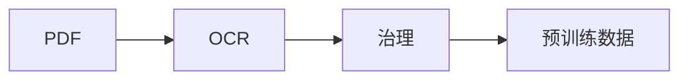

# 编写文档与添加图片

本项目使用 Just the Docs，文档保存在 `docs/`。Markdown 内容同时用于 GitHub 仓库阅读和 Pages 网站发布。

## 双语结构与维护

中文正文在 `docs/*.md`，英文在 `docs/en/*.md`，同一页面使用相同文件名。
中文网站为 `/FinFlow/zh/`，英文为 `/FinFlow/en/`。侧栏与搜索分别构建；
顶部语言切换优先打开对应页面，尚未翻译的中文页会切换到英文首页并显示提示。

翻译 `title`、`parent`、标题、图注和说明；命令、配置键、文件名不变。
英文 `parent` 必须匹配英文父页标题，链接中的标题锚点也需更新。
英文页之间只链接已有翻译；未翻译的详细页可显式链接中文版网站。

`docs/translations.json` 记录英文页的原文 SHA-256 和覆盖范围（`full` 完整翻译或 `summary` 摘要）。
中文改动而译文版本未更新时，英文页显示 **Translation update pending**。
只在完成译文同步后更新 hash，计算命令：

```sh
shasum -a 256 docs/quick-start.md
```

关联根据文件名自动生成，构建脚本只在 `_build/` 生成副本，不覆盖源文档。
英文尚未覆盖的参考教程在英文参考页明确链接中文详版。

## 图片放在哪里

统一放在 `docs/assets/images/`，可按用途建立子目录，例如：

```text
docs/
├── assets/images/
│   ├── pipeline-overview.svg
│   ├── screenshots/preflight.png
│   └── examples/table-crop.png
├── index.md
└── data-flywheel.md
```

截图可用 PNG，照片可用 JPG / WebP，矢量示意图可用 SVG。文件名使用英文、小写和短横线，便于引用。

## Markdown 图片写法

对于位于 `docs/` 顶层的文档，使用相对路径：

```markdown

```


这样在 GitHub 和 Pages 中都能解析；不要写电脑上的绝对路径，或以 `/assets/` 开头的站点根路径。
如果文档在子目录，例如 `docs/guides/example.md`，对应图片路径为 `../assets/images/pipeline-overview.svg`。

英文页在 `docs/en/`，使用 `../assets/images/...` 共用图片。
构建时转换为网站内的 `assets/images/...`。中文截图可配英文图注；英文截图另存 `*-en.png`。

图片旁可以写普通段落作为图注。主题会让宽图适应正文宽度，表格和代码块可横向滚动。

## 控制图片大小

需要指定宽度、懒加载时，可以使用 HTML；下例仍然使用相对路径：

```html

```

## 新增页面与左侧导航

每篇 Markdown 顶部写 YAML front matter。`title` 是导航名称，`parent` 必须与父页面的 `title` 完全一致，`nav_order` 决定同级排序：

```yaml
---
title: 表格处理示例
parent: 数据处理
nav_order: 5
---
```

随后写正文。参考[主题导航说明](https://just-the-docs.github.io/just-the-docs/docs/navigation/main/)。

## 页内目录

正文目录使用：

```markdown
## 本页目录

1. TOC
{:toc}
```

其中 `{:toc}` 是 Jekyll / Kramdown 语法，用于 Pages 中自动生成标题目录。

## Mermaid 流程图

网站已经启用 Mermaid，和 GitHub 一样可以使用 `mermaid` 代码块：

````markdown

````

网站从 jsDelivr 加载 Mermaid；无法访问该 CDN 时，图可能不能渲染。需要离线或固定效果时，使用 SVG / PNG 图片。

## 更新与发布

新增图片和 Markdown 后一起提交、推送。Pages 的首次启用和仓库改名后的地址调整见[发布说明](github-pages.md)。
