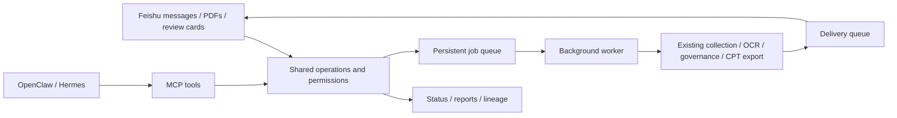

# Feishu and MCP

Use Feishu to inspect runs, submit PDFs, view visual candidates, and record human review.
OpenClaw, Hermes, and other MCP clients can call the same FinFlow service through local stdio.
The native Feishu channel accepts fixed commands; external assistants handle natural language.

This version includes Feishu messaging and a local MCP server. Feishu cloud documents,
Bitable, other native channels, and remote HTTP MCP are not implemented.
Code and static checks are complete; real messaging, card callbacks, and assistant interoperability
still require validation with configured applications.



## 1. Installation

Use Python 3.10+ on macOS or Linux, from the repository root:

```sh
. .venv/bin/activate
python -m pip install -e '.[feishu,mcp]'
cp -n .env.example .env
cp -n config/integrations.json config/integrations.local.json
```

Install only `.[feishu]` or `.[mcp]` if you need one entry point. Add fields to an existing `.env`.
The local integration configuration is Git-ignored and can hold user IDs, chat IDs, and local paths.

Add Feishu credentials to `.env`:

```dotenv
FINFLOW_FEISHU_APP_ID=cli_your_app_id
FINFLOW_FEISHU_APP_SECRET=your_app_secret
```

Read-only MCP needs neither Feishu nor model credentials. Processing requires the existing
[flywheel configuration](data-flywheel.md). All processes must use the same data directory and
flywheel configuration. Global `--data-root` and `--flywheel-config` options go before the subcommand.

## 2. Configure Feishu

Create an internal Feishu application, enable its bot, publish an application version,
and make it available to the intended users. Configure messaging permissions as needed:

| Purpose | Permission |
| --- | --- |
| Receive direct messages to the bot | `im:message.p2p_msg:readonly` |
| Receive group messages mentioning the bot | `im:message.group_at_msg:readonly` |
| Send as the bot | `im:message:send_as_bot` |
| Read messages and attached resources | `im:message:readonly` |
| Download/upload message files and images | `im:resource` |

Select the long connection delivery mode and subscribe to `im.message.receive_v1`.
For review buttons, enable the newer `card.action.trigger` long connection callback.
The official Python SDK receives events without a public webhook endpoint; legacy card callbacks are unsupported.
Consult the [Feishu platform](https://open.feishu.cn/document/home/index),
[official SDK](https://github.com/larksuite/oapi-sdk-python), and
[card callback documentation](https://open.feishu.cn/document/feishu-cards/card-callback-communication)
for current permission and tenant approval requirements.

Obtain the user's application-specific `open_id` with the platform API debugging tools.
Replace the `feishu` section of `config/integrations.local.json` with:

```json
{
  "enabled": true,
  "users": {
    "ou_your_open_id": ["viewer", "operator", "reviewer"]
  },
  "allowed_group_chats": [],
  "notification_chats": []
}
```

Keep the surrounding configuration, including `schema_version`.

| Role | Access |
| --- | --- |
| `viewer` | Status, reports, jobs, candidates, and lineage |
| `operator` | Also import PDFs, enqueue runs, and retry tasks |
| `reviewer` | Also decide on review cards requested by that same person |

Unlisted users cannot submit commands. Every authorized role includes query access;
operator and reviewer privileges are independent. Groups also require their `oc_...` ID in
`allowed_group_chats` and a mention of the current bot. Send PDFs in direct messages first:
group file messages without bot mention metadata are ignored. Restart processes after changing
configuration or environment variables.

If the console requires an active long connection before saving subscriptions, complete local
configuration and start the `feishu` command below first. Keep it running while saving the subscriptions.

```sh
python -m integrations.cli --config config/integrations.local.json preflight --channel feishu
python -m integrations.cli --config config/integrations.local.json feishu
```

Preflight checks local configuration/dependencies without contacting services.
Top-level `status` describes the channel; nested `pipeline.status` describes processing readiness.
An incomplete pipeline still allows channel queries and PDF storage; imported jobs then return
`partial`, with OCR queued until configuration is ready.

The foreground `feishu` command starts both the socket connection and worker. Sleeping,
shutting down, or terminating the process stops service. Use a server process manager for
persistent operation. GitHub Pages only hosts the static documentation.

## 3. Feishu commands

| Input | Action |
| --- | --- |
| `/help` | Command reference |
| `/status` | Pipeline, visual, candidate, and delivery counts |
| `/report` or `/report 2026-10-02` | Report for a date in the configured timezone |
| `/audit` | First 20 candidates needing review |
| `/candidate ID` | Candidate text, evidence attachment, and original image when available |
| `/trace candidate ID` | Source lineage; also accepts `sample` or `artifact` |
| `/run` | Queue discovery and processing |
| `/run --no-discover` | Process existing data and backlog |
| `/job job-...` | Read a background job result |
| `/retry TASK_ID` or `/retry job-...` | Explicitly retry an eligible task/job |
| Send one PDF file | Store the attachment, register source lineage, and queue processing |

Long operations immediately return a job ID and send a completion/failure notification later.
The default attachment limit is 32 MiB (`max_attachment_mb`). Duplicate delivery of the same
Feishu message ID does not enqueue another job; a newly sent message is a new request.
Retrying a pipeline task only requeues it; follow with `/run --no-discover` or wait for the daily scheduler.

Imports preserve application, chat, message, file, and authenticated actor identity.
The existing lineage continues through PDF → OCR → text/visuals → candidates → training samples.
Identical content shares a stored file while separate origins remain recorded. Retrying an import
job preserves its original source identity.

### Review text and visuals

For reviewers, `/candidate` sends the original image when available, the full candidate JSON,
and a decision card. Card excerpts may be truncated: inspect the attachment and original evidence.
Accept/reject/needs-review buttons record the authenticated person's decision.
Use the ticket printed on the card to provide a detailed reason:

```text
/review TICKET rejected The table unit disagrees with the original image
```

Tickets bind the requesting person, conversation, candidate checksum, and existing decision version.
They expire after one hour by default. Forwarded cards, another person's clicks, changed evidence,
and expired tickets cannot reuse that authorization. Request a new candidate card to change a decision.
Changed image checksums block review. Each card can submit only one decision.

Acceptance still requires source training admission in `config/flywheel.json`.
Uploaded sources are `app-feishu`, `app-mcp`, and `app-local`, with training unapproved by default.
Only configure `source_policy` after confirming the intended scope: it applies to all files from
that channel. There is no per-upload licensing interface yet. Accepted candidates enter publication
on the next flywheel run.

### Report notifications

Add recipient `oc_...` chat IDs to `notification_chats` and keep the worker running.
When a new saved flywheel summary appears for today, the worker enqueues an updated daily report
once per run and destination. The default timezone is `Asia/Shanghai`.
Candidate/backlog counts are the latest cumulative snapshot; completed-task/model-request counts
sum today's saved run summaries. Keep the existing [cron/launchd schedule](data-flywheel.md#6-daily-scheduling)
for collection. After downtime across midnight, use `/report DATE` for an earlier day.
Preflight failures without a saved summary are absent from automatic reports.

## 4. OpenClaw and Hermes

MCP defaults to six read-only tools: `finflow_status`, `finflow_report`, `finflow_candidates`,
`finflow_candidate`, `finflow_trace`, and `finflow_job`. The assistant starts a local stdio process.
Replace every `/path/to/FinFlow` below with an absolute checkout path. Set `cwd` to the repository
root so the correct `.env` is loaded.

### OpenClaw

Merge into the OpenClaw configuration (normally `~/.openclaw/openclaw.json`):

```json
{
  "mcp": {
    "servers": {
      "finflow": {
        "transport": "stdio",
        "command": "/path/to/FinFlow/.venv/bin/python",
        "args": ["-m", "integrations.cli", "--config", "/path/to/FinFlow/config/integrations.local.json", "--data-root", "/path/to/FinFlow/data", "mcp"],
        "cwd": "/path/to/FinFlow",
        "enabled": true
      }
    }
  }
}
```

Configuration reference: [OpenClaw MCP](https://docs.openclaw.ai/tools/mcp).

### Hermes

Merge into `~/.hermes/config.yaml`:

```yaml
mcp_servers:
  finflow:
    command: /path/to/FinFlow/.venv/bin/python
    args:
      - -m
      - integrations.cli
      - --config
      - /path/to/FinFlow/config/integrations.local.json
      - --data-root
      - /path/to/FinFlow/data
      - mcp
    cwd: /path/to/FinFlow
    enabled: true
```

Configuration reference: [Hermes MCP](https://hermes-agent.nousresearch.com/docs/user-guide/features/mcp/).
Restart/reload the client, then ask it to inspect today's FinFlow status. These are standard MCP
configurations; neither assistant has been connected for live acceptance testing in this implementation session.

### Optional mutations

To allow the assistant to submit jobs, change the local configuration's `mcp` section:

```json
{
  "allow_mutations": true,
  "import_roots": ["/absolute/path/to/incoming-pdfs"]
}
```

Restart both MCP and the worker. Three tools are added: `finflow_run`, `finflow_import_pdf`,
and `finflow_retry`. Imports accept one PDF within an allowed root, including after resolving
symlinks. Mutations require `request_id`: reuse it for transport retries of the same request;
changed parameters need a new ID. Jobs use the configured OCR/models and budgets.
Poll the returned ID with `finflow_job`.

MCP exposes no human-review action. Its single local service identity does not distinguish
the external assistant's individual chat users. Keep read-only access for shared assistants or
apply the assistant's own authorization controls.

For MCP-only operation, run a separate worker:

```sh
python -m integrations.cli --config config/integrations.local.json --data-root /path/to/FinFlow/data worker
```

An already running `feishu` process with the same configuration includes that worker.

## 5. Local operations and recovery

```sh
python -m integrations.cli status
python -m integrations.cli import-pdf /absolute/path/report.pdf --request-id report-2026-10-02
python -m integrations.cli run --no-discover --request-id run-2026-10-02
python -m integrations.cli job job-ID
```

These use the default configuration. Add `--config config/integrations.local.json` before the
subcommand when needed. `worker --once` attempts one incoming event, one job, and one notification;
it can execute a complete flywheel run and is not a read-only check.

| Path under the data root | Contents |
| --- | --- |
| `state/integrations.db` | Inbox, jobs, outbox, review tickets, and operation audit |
| `state/pipeline.db` | Existing tasks, visuals, candidates, and artifact lineage |
| `integrations/inbox/` | Imported PDFs addressed by SHA-256 |
| `integrations/downloads/` | Temporary downloads, removed after normal processing |
| `manifests/source_records/` | Application origins registered as lineage artifacts |

A process lock serializes application jobs; the existing flywheel lock also applies.
Jobs wait when a scheduled run holds that lock. After a process dies, abandoned running jobs
become `interrupted`. Inspect their underlying effects before explicitly retrying them.
Submitted reviews are not automatically retried; request fresh evidence and inspect the latest decision.

Inbox/outbox failures back off and stop after five attempts. Outbound stages checkpoint message
receipts and use Feishu message UUIDs to help deduplicate retries. Network/process interruptions
can still produce duplicate notifications; exactly-once delivery is not guaranteed.

Recover failed notifications after fixing credentials, permissions, or connectivity:

```sh
python -m integrations.cli --config config/integrations.local.json deliveries --status failed
python -m integrations.cli --config config/integrations.local.json retry-delivery DELIVERY_ID
```

Successful stages retain their receipts. Deliveries rejected after access revocation cannot be
requeued by this command. Inspect failed inbox counts with `/status`; resend the command/file after
fixing its cause. Errors expose their type, not raw provider responses. Stop relevant processes
before backing up the complete data directory, including databases and local evidence.

## 6. Implementation map

- `integrations/service.py`: shared operations, provenance, and human review.
- `integrations/store.py`, `runtime.py`: persistence, locks, background jobs, and notifications.
- `integrations/channels/feishu.py`: event normalization, files, images, and cards.
- `integrations/mcp_server.py`: read-only default and optional mutation tools.
- `integrations/cli.py`: command entry point.

The implementation adopts adapter, shared-tool, queue, and outbox patterns without copying
OpenClaw/Hermes source or depending on their agent runtimes. Future channels should authenticate
platform identities before calling the same service and preserve roles, deduplication, provenance,
and delivery receipts.
