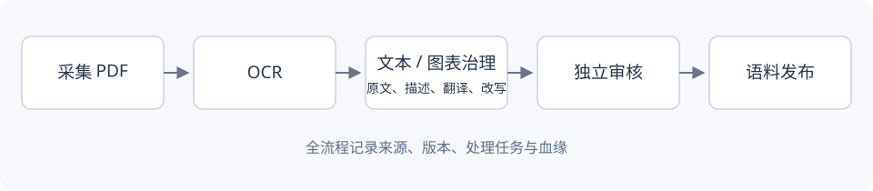

# Writing docs and adding images

Chinese pages live in `docs/*.md`; English pages in `docs/en/*.md`. Use matching
filenames for counterparts. `scripts/prepare_docs.py` stages independent language
sites under `_build/` without modifying sources.

## Add or update a translation

Translate title, parent, headings, prose, and captions. Keep commands, configuration
keys, and filenames unchanged. English `parent` must match the English parent page's
title. Update heading anchors after translating headings.

Each English page needs an entry in `docs/translations.json` with `source_sha256`
and `coverage` (`full` or `summary`). Calculate the original's revision:

```sh
shasum -a 256 docs/quick-start.md
```

Update that revision only after synchronizing the translation. Changed Chinese
sources show **Translation update pending** on the English page until then.
Missing English counterparts lead to the English home page with a Chinese tooltip.

## Shared images

Put images in `docs/assets/images/`: PNG for screenshots, JPG/WebP for photos, SVG
for diagrams. Use lowercase English filenames with hyphens. Chinese top-level
pages use `assets/images/...`; English pages use `../assets/images/...`:

```markdown

```


The build rewrites English asset paths for the staged site. Explain Chinese
screenshot labels in English captions, or add separate `*-en.png` screenshots.
Avoid computer absolute paths. For width or lazy loading:

```html

```

## Navigation and contents

Add front matter:

```yaml
---
title: A new reference page
parent: Reference and design
nav_order: 4
---
```

`nav_order` controls sibling order. For a table of contents:

```markdown
## On this page
{: .no_toc }

1. TOC
{:toc}
```

Mermaid fenced blocks render on GitHub and the site. The site loads Mermaid from
jsDelivr; use SVG/PNG for offline or fixed rendering. Commit Markdown and images
together. See [Pages publishing](github-pages.md).
