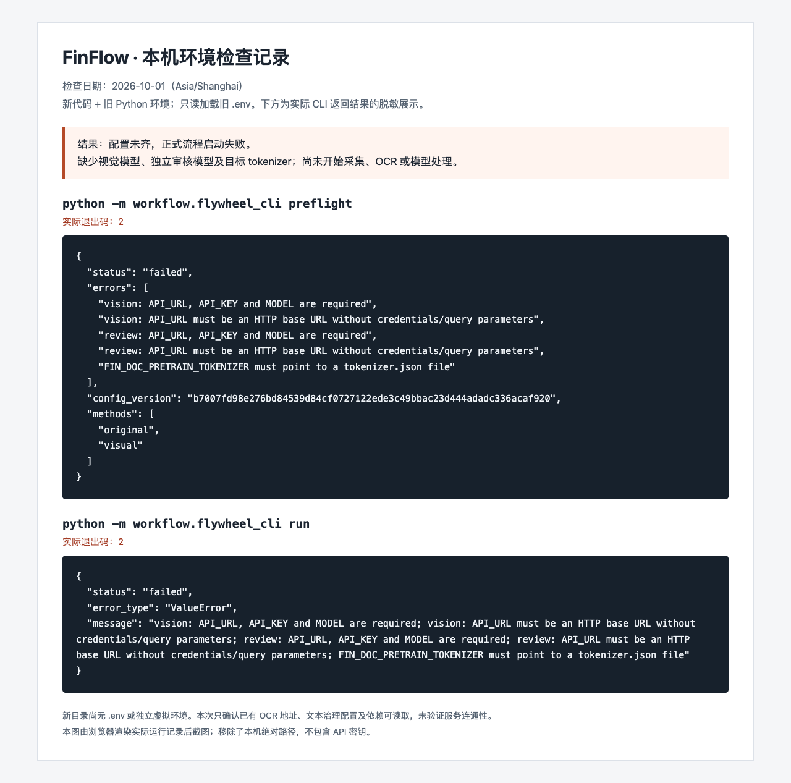

# 本机环境检查记录

这是一份 **2026-10-01 的实际检查记录**，用于说明配置缺失时如何定位问题。它不是完整流程成功运行的示例，也不代表其他机器的配置状态。

## 检查结果

| 检查项 | 当时状态 | 含义 |
| --- | --- | --- |
| 新 FinFlow 目录的 `.env` | 不存在 | 新仓库迁移时未复制本机凭据，需要单独配置 |
| 新目录的 Python 虚拟环境 | 不存在 | 本次临时使用旧项目已安装依赖的 Python |
| 旧 `.env` 的本地 OCR 地址 | 已填写 | 仅确认配置存在，尚未验证 OCR 服务连通性 |
| 旧 `.env` 的文本治理模型 | 地址、密钥和模型名已填写 | 仅确认配置存在，尚未验证模型调用 |
| 视觉描述模型 | 地址、密钥和模型名未填写 | 默认 `visual` 方法无法执行 |
| 独立审核模型 | 地址、密钥和模型名未填写 | 正式候选审核无法执行 |
| 目标 tokenizer | 未配置 | 无法按目标模型的 token 长度构建预训练数据 |

本次在新项目根目录运行新代码，只读加载旧项目的 `.env`，没有将旧配置或旧数据迁入新仓库。`preflight` 与 `run` 均返回 `failed`，退出码为 **2**。`run` 在配置预检阶段退出，没有启动采集、OCR 或模型请求，也没有生成训练数据或新状态数据库。

## 实际结果截图



图中内容来自实际 CLI 返回值，经过 HTML 排版后由浏览器截图；本机绝对路径已移除，没有显示密钥。原始运行记录保存在本机被 Git 忽略的 `data/runs/env-check-2026-10-01/`，不随文档发布。

预检中同时出现“缺少 API 配置”和“API URL 格式错误”，是因为空地址也未通过 URL 校验，并不表示已有地址填错。

## 如何补齐配置并重跑

在新项目根目录建立独立环境，已有 `.env` 时不要覆盖：

```sh
python3 -m venv .venv
. .venv/bin/activate
python -m pip install -e .
cp -n .env.example .env
```

将 OCR 与文本治理配置填入新 `.env`，并补齐以下字段。密钥只填本机文件，不发到聊天或提交到仓库。

```dotenv
FIN_DOC_VISION_API_URL=
FIN_DOC_VISION_API_KEY=
FIN_DOC_VISION_MODEL=
FIN_DOC_PRETRAIN_REVIEW_API_URL=
FIN_DOC_PRETRAIN_REVIEW_API_KEY=
FIN_DOC_PRETRAIN_REVIEW_MODEL=
FIN_DOC_PRETRAIN_TOKENIZER=/absolute/path/to/target-model/tokenizer.json
```

视觉模型应支持图像输入；默认视觉候选的审核模型也需要支持图像。tokenizer 必须对应计划继续预训练的目标模型，不能随意换一个文件来通过预检。

配置完成后执行：

```sh
python -m workflow.flywheel_cli preflight
# 预检返回 success 后，确认少量采集目标、预算和来源训练准入，再执行：
python -m workflow.flywheel_cli run
```

预检通过只说明本地配置与依赖满足要求；服务连通性、模型能力、OCR 质量和最终语料仍需真实运行验证。默认来源准入策略为空，即使成功采集，也需要在配方中明确来源可用于训练的范围才能产生合格语料。

详细步骤见[每日数据飞轮](data-flywheel.md)，配置与真实运行通过并抽查产物后再启用定时。
