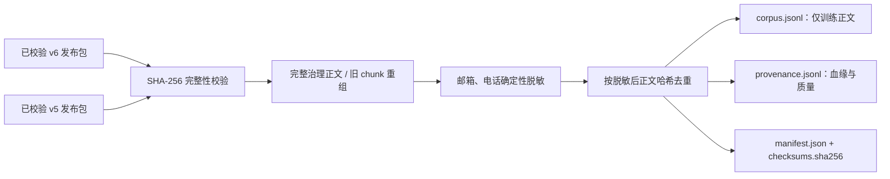

# 已有发布包生成预训练语料
{: .no_toc }

## 本页目录
{: .no_toc }

1. TOC
{:toc}


[文档首页](index.md) · [项目首页](https://github.com/Chal1ce/FinFlow/blob/main/README.md)

本页对应 `training.cli` 和 v5/v6 发布包。**每日飞轮的 v7 发布、目标 tokenizer、图表描述及翻译/改写候选使用[飞轮运行说明](data-flywheel.md#5-发布与训练数据)**，两套入口的审核与分段策略不同。

继续预训练数据只从已经完整性校验的本地发布包生成，与采集、OCR、治理和工作流接口隔离。此入口不包含 SFT 指令数据、评测集或训练框架，不调用模型；它产出可审计、模型无关的 JSONL 语料。



先验证每个选定的发布包，再创建一个新的数据集目录。`--release` 可以重复指定；`dataset_id` 一旦存在就会失败，避免覆盖既有语料：

```powershell
python -m workflow.cli --data-root data verify-release `
  --batch-id fin-2026-08-11 --release-id <release_id>

python -m training.cli --data-root data build-pretrain `
  --dataset-id financial-governed-v1 `
  --release fin-2026-08-11/<release_id> `
  --release research-2026-08-11/<release_id>
```

命令会在 `data/training/pretrain/financial-governed-v1/` 原子写入：

- `corpus.jsonl`：每行只包含 `schema_version`、稳定 `sample_id` 和脱敏后的 `text`，不插入标题、来源或检索增强内容；
- `provenance.jsonl`：发布包、文档/资产身份、来源、规则版本、OCR 质量、正文哈希、脱敏计数与收录状态；同一正文去重后仍保留所有来源；
- `excluded.jsonl`：空正文和重复正文的排除原因；
- `manifest.json`：输入发布包、计数、脱敏规则、质量汇总与数据集策略；
- `checksums.sha256`：以上四个文件的 SHA-256 清单。

发布格式 `financial-document-delivery-v6` 提供完整正文快照，来源保真度标记为 `full_governed_document`。旧的、已校验 `v5` 包仍可使用，但只能按 `chunks.jsonl` 重组，数据集会明确标记 `lossy_chunk_reconstruction`。构建器保留 OCR `needs_review` 文档，不把质量告警拼入正文，质量信号仅保存在 `provenance.jsonl` 和 `manifest.json`。

这类数据集固定标记 `usage_scope=internal-only`、`rights_status=unknown`。确定性规则只替换电子邮箱为 `<EMAIL>`、中国大陆手机和常见固话为 `<PHONE>`；这不是版权、隐私或业务合规审查的替代品，训练前仍须确认来源授权和适用范围。
